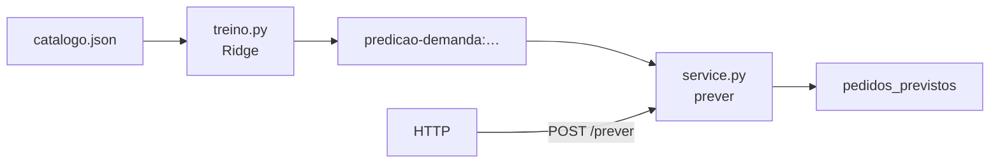

# Predição de demanda no BentoML

Irmão do
[`recomendador-bentoml`](https://github.com/lgallindo/recomendador-bentoml):
mesmo catálogo de artesanato pernambucano e o mesmo estilo de aula (JSON →
`treino.py` → artefato BentoML → HTTP), mas a pergunta muda.

| | Recomendador | Este repo |
| --- | --- | --- |
| Pergunta | “O que sugerir na página?” | “Quantos pedidos esperar?” |
| Saída | lista ranqueada | número (`pedidos_previstos`) |
| Família MS Learn | (ranking / híbrido) | **regressão** |
| Endpoint | `POST /recomendar` | `POST /prever` |

Aqui treinamos uma **Ridge** com one-hot de `tecnica` + `regiao` para prever o
campo `pedidos` do catálogo. É o caminho “Data Science → Machine Learning” do
módulo
[Fundamentos do aprendizado de máquina](https://learn.microsoft.com/pt-br/training/modules/fundamentals-machine-learning/4-regression)
(unidade de regressão), sem montar top‑k.

## Subir

```bash
uv sync
just treino
just serve
just curl-exemplo
```

Swagger em `http://127.0.0.1:3000`.

### Exemplo

```bash
just curl-exemplo
```

Corpo: `{"produto_id":"p01"}` — devolve `pedidos_previstos`, `pedidos_reais` e
`erro_absoluto` (útil na aula para ver o ajuste).

Produto hipotético (sem id):

```bash
just curl-hipotetico
```

`{"tecnica":"ceramica","regiao":"Tracunhaém"}`.

## Dados

[`dados/catalogo.json`](dados/catalogo.json) — mesmos `produtos` do recomendador
(o array `cestas` pode existir no arquivo, mas **este** treino não o usa: a
regressão olha só atributos do item).

## Workflow



## O que este material não é

Não é série temporal (não há datas), não é estoque, não é recomendação. Para
sugerir produtos na vitrine, volte ao recomendador. Para enriquecer a regressão
(mais features, holdout, RMSE), siga o learning path
[Criar modelos de machine learning](https://learn.microsoft.com/pt-br/training/paths/create-machine-learn-models/).

## Licença

**GPL-3.0** — ver [`LICENSE`](LICENSE).
