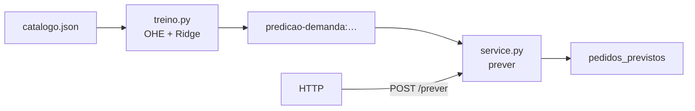
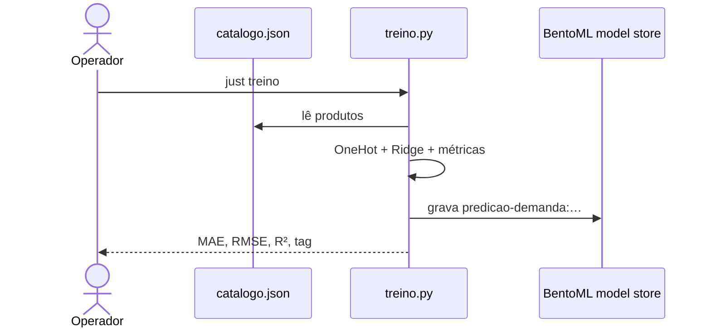
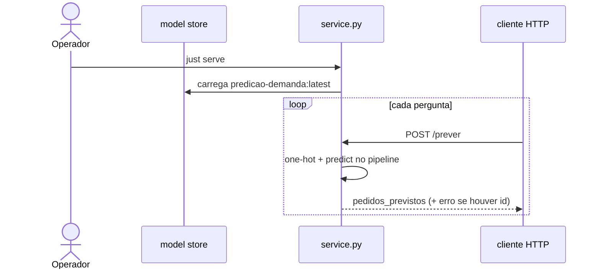

# Predição de demanda no BentoML

Chega junho. O São João enche o calendário e a loja de artesanato — jarro de
barro de Tracunhaém, renda do Alto do Moura, xilogravura da Comunidade do Pilar —
precisa decidir **quanto produzir e quanto deixar pronto no estoque**. Pedir
demais amarra dinheiro em peça que fica na prateleira; pedir de menos esgota o
best-seller no meio da festa. A pergunta do dia a dia é concreta: **quantos
pedidos esperar** para cada peça?

Para o jarro que já vendeu quarenta e duas vezes, dá para olhar o passado. O
aperto maior é a peça **nova**: mesma técnica, mesmo polo, id ainda por nascer.
A loja então usa uma regra que lê **atributos** do produto (técnica, região) e
devolve um **número**. Esse número é a **predição de demanda**.

Este material parte do zero em ciência de dados. Você monta uma tabela, separa
**features** de **rótulo**, transforma texto em números com **one-hot encoding**,
ajusta uma **Ridge**, mede o erro com MAE / RMSE / R², e sobe um serviço HTTP no
BentoML que responde `pedidos_previstos`. Dois comandos sobem o ciclo; o
Swagger ou o `curl` mostram o JSON; o caderno em `material/` refaz as contas.

## O caminho deste material

| Etapa | O que você leva |
| --- | --- |
| 1. Pergunta da loja | Demanda como número; peça conhecida × peça hipotética |
| 2. Tabela | Observação, coluna, feature, rótulo |
| 3. One-hot | Por que texto vira 0/1; o problema de codificar como 1, 2, 3… |
| 4. Modelo | Média global → média do grupo → reta com pesos → Ridge |
| 5. Métricas | MAE, RMSE, R² — o que cada uma responde ao estoque |
| 6. Serviço | `just treino` · `just serve` · `POST /prever` |

Contas passo a passo do jarro (`p01`):
[`material/calculos-trabalhados.md`](material/calculos-trabalhados.md).

Mapa das pastas:

| Pasta | Papel |
| --- | --- |
| [`dados/`](dados/) | Catálogo JSON — a “memória” da loja neste exercício |
| [`material/`](material/) | Contas trabalhadas alinhadas ao `curl-exemplo` |

## A tabela da loja

Cada linha é um **produto** (uma observação). Cada coluna é um atributo. Pense
num caderno de encomendas passado a limpo:

| id | nome | tecnica | regiao | pedidos |
| --- | --- | --- | --- | ---: |
| p01 | Jarro barro Tracunhaém | ceramica | Tracunhaém | 42 |
| p02 | Prato esmaltado Tracunhaém | ceramica | Tracunhaém | 28 |
| … | … | … | … | … |

No vocabulário de aprendizado de máquina:

| Nome neste material | Neste catálogo | Papel |
| --- | --- | --- |
| **Feature** (recurso / atributo de entrada) | `tecnica`, `regiao` | O que o modelo **vê** para prever |
| **Rótulo** (label / alvo) | `pedidos` | O número que queremos **aproximar** |
| **Observação** | uma linha de `produtos[]` | Um exemplo \((x, y)\) |

Arquivo completo e significado de cada campo: [`dados/README.md`](dados/README.md).

### Por que só técnica e região?

Com doze peças, dois atributos categóricos bastam para ver o ciclo inteiro:
preparar \(X\), treinar, medir, servir. O modelo aprende um padrão do tipo
“cerâmica em Tracunhaém pede por volta de \(N\)”.

O `id` fica fora do \(X\): ele só localiza a linha na API. O `nome` também fica
fora: é rótulo humano na resposta, não sinal numérico. Se o nome entrasse como
texto cru, cada peça teria um código próprio e o modelo memorizaria a linha em
vez de generalizar o **grupo**.

## Features e rótulo no papel

Para o jarro `p01`:

```text
# Variáveis:
#   x — vetor de entrada (ainda em texto)
#   y — alvo numérico (pedidos observados)

x ← (tecnica = "ceramica", regiao = "Tracunhaém")
y ← 42
```

O computador soma e multiplica números. `"ceramica"` ainda é texto — o próximo
passo transforma cada valor categórico em colunas 0/1.

## One-hot encoding

### Motivação técnica: categorias como interruptores, não como fila numérica

Uma tentação comum é codificar `ceramica=1`, `renda=2`, `xilogravura=3`,
`cestaria=4`. Isso **inventa uma ordem e uma distância** entre ofícios: o
modelo linear trataria esses inteiros como quantidades (renda “vale o dobro”
de cerâmica) e torceria a previsão sem motivo artesanal.

O **one-hot** trata cada valor como interruptor 0/1. O produto acende só a
coluna do valor que ele tem; cada técnica (e cada região) ganha o próprio
peso \(w_j\), independente dos outros.

### As sete colunas deste catálogo

Há **4** técnicas e **3** regiões → **7** colunas:

| Coluna | Significado |
| --- | --- |
| `tecnica_ceramica` | 1 se a técnica for cerâmica |
| `tecnica_cestaria` | 1 se for cestaria |
| `tecnica_renda` | 1 se for renda |
| `tecnica_xilogravura` | 1 se for xilogravura |
| `regiao_Alto do Moura` | 1 se a região for Alto do Moura |
| `regiao_Comunidade do Pilar` | 1 se for Comunidade do Pilar |
| `regiao_Tracunhaém` | 1 se for Tracunhaém |

Vetor do jarro (`ceramica` + `Tracunhaém`):

| ceramica | cestaria | renda | xilogravura | Alto do Moura | Pilar | Tracunhaém |
| ---: | ---: | ---: | ---: | ---: | ---: | ---: |
| 1 | 0 | 0 | 0 | 0 | 0 | 1 |

```text
# Variáveis:
#   tecnica, regiao — strings do produto
#   valores_tecnica — lista ordenada das técnicas vistas no treino
#   valores_regiao  — lista ordenada das regiões vistas no treino
#   z               — vetor numérico 0/1 (entrada do regressor)

valores_tecnica ← ["ceramica", "cestaria", "renda", "xilogravura"]
valores_regiao  ← ["Alto do Moura", "Comunidade do Pilar", "Tracunhaém"]

z ← []
para cada t em valores_tecnica:
    z.append(1 se tecnica = t senão 0)
para cada r em valores_regiao:
    z.append(1 se regiao = r senão 0)
# jarro → [1, 0, 0, 0, 0, 0, 1]
```

No código isso é o `OneHotEncoder` dentro do `ColumnTransformer` em
`treino.py`. Com `handle_unknown="ignore"`, uma técnica nova na inferência
acende zeros nas colunas de técnica já vistas — a previsão cai no que os pesos
de região (e o intercepto) conseguem dizer.

## Da média à reta

A loja pode chutar demanda de vários jeitos. Cada chute responde a uma pressão
diferente do estoque.

### Chute 0 — média global

Média dos `pedidos` no catálogo: \(260 / 12 \approx 21{,}67\). Um único número
para tudo. Rápido de calcular; trata jarro de cerâmica e sousplat de palha como
se pedissem o mesmo.

### Chute 1 — média do grupo

Para o grupo `(ceramica, Tracunhaém)` os pedidos são 42, 28 e 19 → média
\(\approx 29{,}67\). Melhor para esse grupo. O custo: cada combinação
técnica×região precisa de exemplos próprios. Uma combinação rara (uma só peça)
fica “colada” nesse único \(y\); uma combinação **ainda sem linha** no
catálogo fica sem média própria até existir observação.

### Modelo linear

Depois do one-hot, o modelo soma um **intercepto** \(b\) com um **peso**
\(w_j\) por coluna acesa:


$$
\hat{y} = b + \sum_j w_j \, z_j
$$

Para o jarro só duas colunas valem 1:


$$
\hat{y}_{\mathrm{jarro}} = b + w_{\mathrm{ceramica}} + w_{\mathrm{Tracunhaém}}
$$

Motivação: os pesos de técnica e de região **somam**. Cerâmica “puxa” para cima
ou para baixo; Tracunhaém também. Uma peça hipotética nova herda esses puxões
sem precisar de um id antigo.

### Ridge

Com poucos exemplos e várias colunas, um ajuste sem freio pode colar demais nos
doze números do JSON. A **Ridge** (`Ridge(alpha=1.0)` no `treino.py`) busca
pesos que explicam \(y\) e, ao mesmo tempo, **permanecem moderados** (penalidade
L2 sobre os \(w_j\)).

Efeito visível neste catálogo: o grupo cerâmica/Tracunhaém tem média
\(29{,}67\); a Ridge prevê \(\approx 28{,}56\) — um pouco puxada na direção da
média global (\(\approx 21{,}67\)). Esse puxão é a regularização trabalhando a
favor da generalização quando \(n\) é pequeno.

Pseudocódigo do treino (o que `treino.py` faz):

```text
# Variáveis:
#   produtos — lista de registros do catalogo.json
#   X        — matriz de features (técnica, região) ainda em texto
#   y        — vetor de pedidos (rótulo)
#   pipe     — Pipeline: OneHotEncoder → Ridge
#   artefato — dict gravado no model store do BentoML

X ← coluna(tecnica), coluna(regiao) para cada produto
y ← pedidos de cada produto
pipe ← OneHotEncoder + Ridge(alpha=1)
ajustar pipe a (X, y)
artefato ← {pipeline, produtos, mae_treino, estrategia, …}
gravar artefato no store BentoML como predicao-demanda:…
```

## Métricas

Depois do ajuste, comparamos \(\hat{y}_i\) com \(y_i\) em cada produto do
catálogo. Aqui a avaliação é **no próprio treino** (in-sample): serve para você
entender o ajuste e bater o `curl` com o caderno. Em um projeto maior, a mesma
ideia usa um conjunto de validação (holdout).

| Métrica | Pergunta que responde | Neste catálogo (alpha=1) |
| --- | --- | ---: |
| **MAE** | Em média, quantos pedidos a previsão erra? | ≈ 7,43 |
| **RMSE** | E se erros grandes doessem mais (ao quadrado)? | ≈ 8,70 |
| **R²** | Que fração da variação de `pedidos` o \(X\) explica? | ≈ 0,29 |

Leitura para o estoque:

- **MAE ≈ 7,4** — reserve margem mental de cerca de sete pedidos em torno de
  \(\hat{y}\) neste exercício.
- **RMSE um pouco acima do MAE** — há erros maiores (o jarro com 42 puxa).
- **R² ≈ 0,29** — técnica + região já contam uma história; nome da peça, preço e
  sazonalidade ficariam em features futuras.

O `just treino` imprime as três. Contas linha a linha:
[`material/calculos-trabalhados.md`](material/calculos-trabalhados.md).

## O que o modelo enxerga

`p01`, `p02` e `p03` compartilham `ceramica` + `Tracunhaém`. O vetor one-hot é
**o mesmo** → a previsão é **a mesma** (\(\approx 28{,}56\)), embora os pedidos
reais sejam 42, 28 e 19. O erro absoluto do jarro fica grande porque o modelo
vê o **grupo**, e o charme individual da peça fica de fora deste \(X\).

Isso também é o que permite a peça hipotética: `just curl-hipotetico` manda só
técnica e região e recebe a previsão de grupo — o chute da loja **antes** do
primeiro pedido daquela peça nova.

## Workflow

Dois momentos distintos. Em MLOps, dois papéis: quem **treina** prepara o
artefato; quem **consulta** a API só pede um número. Misturar os dois a cada
clique tornaria a vitrine lenta e o treino irreprodutível.

| Momento | Em MLOps | Neste repo | Quem age | Frequência |
| --- | --- | --- | --- | --- |
| **Treino** (offline) | *training* / *batch* | `just treino` → `treino.py` | Você (operador local) | Quando o catálogo ou a fórmula mudam |
| **Inferência** (online) | *inference* / *serving* | `just serve` → `POST /prever` | Cliente HTTP (planilha, vitrine, `curl`) | A cada pergunta de demanda |



### Sequência 1 — só o treino



### Sequência 2 — só a inferência



## O que a API espera e o que ela devolve

Depois de `just serve`, o serviço escuta em `http://127.0.0.1:3000`.

```http
POST /prever
Content-Type: application/json
```

### Entrada (duas formas)

| Forma | Campos | Quando usar |
| --- | --- | --- |
| Produto conhecido | `produto_id` | Id existe em `catalogo.json` — a API lê técnica/região e ainda devolve `pedidos_reais` e `erro_absoluto` |
| Produto hipotético | `tecnica` + `regiao` | Peça nova, sem id — só a previsão do grupo |

### Saída (produto conhecido, sucesso)

| Campo | Significado |
| --- | --- |
| `pedidos_previstos` | \(\hat{y}\) arredondado |
| `pedidos_reais` | \(y\) do catálogo |
| `erro_absoluto` | \(\lvert y - \hat{y}\rvert\) |
| `tecnica`, `regiao` | Atributos usados |
| `strategy` | `ridge_tecnica_regiao` |
| `mae_treino` | MAE gravado no artefato |
| `modelo` | Tag no store BentoML |

### Saída (erros da API)

```json
{"erro": "produto_inexistente", "produto_id": "nao-existe"}
```

```json
{"erro": "informe_produto_id_ou_tecnica_e_regiao", "produto_id": null}
```

## Como subir

Pré-requisitos: [uv](https://docs.astral.sh/uv/) e [just](https://github.com/casey/just).

```bash
uv sync
just treino
just serve
```

Em outro terminal:

```bash
just curl-exemplo        # jarro p01
just curl-hipotetico     # ceramica + Tracunhaém sem id
just curl-inexistente    # produto_inexistente
```

Swagger: <http://127.0.0.1:3000>.

Depois do `curl-exemplo`, abra
[`material/calculos-trabalhados.md`](material/calculos-trabalhados.md) e
confira `pedidos_previstos` ≈ 28,56 e `erro_absoluto` ≈ 13,44.

## Empacote e container (Bento → imagem OCI)

O treino continua offline. O empacote congela a **inferência** num Bento e
depois numa imagem Docker — útil quando a API precisa rodar igual na sua máquina
e num servidor.

```bash
just treino
just imagem              # build + containerize → predicao-demanda:aula
just serve-container     # Docker na porta 3000
```

Pare o `just serve` local na `:3000` antes do container. O que entra no pacote
está em [`bentofile.yaml`](bentofile.yaml).

## Nomes neste repo e na literatura

| Neste repo | Na literatura / scikit-learn |
| --- | --- |
| `tecnica`, `regiao` | *features* categóricas |
| `pedidos` | *label* / alvo de regressão |
| `OneHotEncoder` | *dummy variables* / encoding one-hot |
| `Ridge(alpha=1)` | regressão linear com penalidade L2 |
| `mae_treino` | erro absoluto médio (avaliação in-sample aqui) |
| artefato + `POST /prever` | *offline train* + *online inference* |

## Microsoft Learn

Unidade de regressão (features → modelo → métricas):

[Fundamentos do aprendizado de máquina — Regressão](https://learn.microsoft.com/pt-br/training/modules/fundamentals-machine-learning/4-regression)

Caminho seguinte com exercícios scikit-learn:

[Criar modelos de machine learning](https://learn.microsoft.com/pt-br/training/paths/create-machine-learn-models/)

## Diagramas neste README

| Diagrama | Seção | Pergunta |
| --- | --- | --- |
| Artefato + API | Workflow | Onde entram JSON, pickle e o cliente? |
| Só o treino | Workflow | Quem prepara o artefato? |
| Só a inferência | Workflow | Quem fala na hora da pergunta? |

## Licença

**GPL-3.0** — ver [`LICENSE`](LICENSE).
