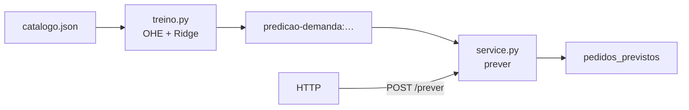
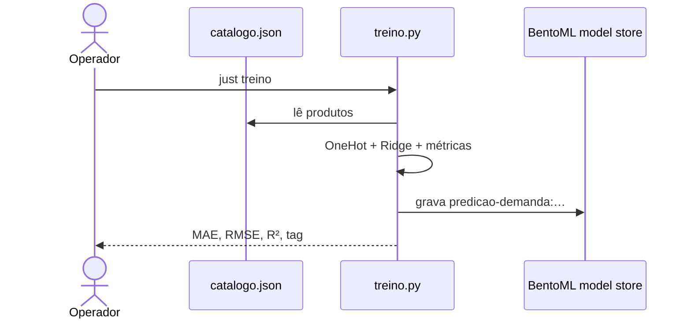
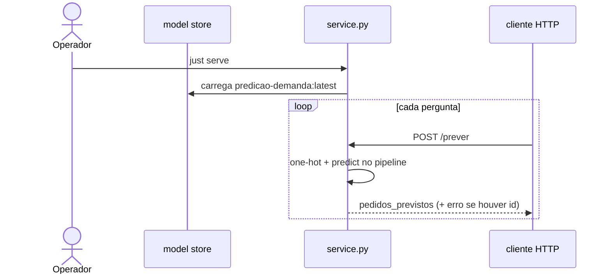

# Predição de demanda no BentoML

Chega junho e a feira de artesanato enche o calendário. A loja online tem jarro
de barro de Tracunhaém, renda do Alto do Moura, xilogravura da Comunidade do
Pilar. A pergunta do estoque é concreta: **quantos pedidos esperar** para cada
peça — e também para uma peça **nova**, que ainda vai entrar na vitrine.

Contar o passado resolve o que já vendeu. Para generalizar — “cerâmica de
Tracunhaém tende a pedir quanto?” — a loja usa uma regra que lê atributos do
produto e devolve um número. Esse número é a **predição de demanda**.

Este repositório parte do zero em ciência de dados: monta uma tabela, separa
**features** de **rótulo**, transforma texto em números com **one-hot encoding**,
ajusta uma **Ridge**, mede o erro, e sobe um serviço HTTP no BentoML que responde
`pedidos_previstos`. Você sobe com dois comandos, confere no Swagger ou no
`curl`, e depois refaz as contas no caderno.

## O arco da aula

| Ato | O que a turma leva |
| --- | --- |
| 1. Pergunta da loja | Demanda como número; peça conhecida × peça hipotética |
| 2. Tabela | Observação, coluna, feature, rótulo |
| 3. One-hot | Por que texto vira 0/1; vetor do jarro no papel |
| 4. Modelo | Média global → média do grupo → reta com pesos → Ridge |
| 5. Métricas | MAE, RMSE, R² no próprio catálogo |
| 6. Serviço | `just treino` · `just serve` · `POST /prever` |

Contas passo a passo do jarro (`p01`):
[`material/calculos-trabalhados.md`](material/calculos-trabalhados.md).

## A tabela da loja

Cada linha é um **produto** (uma observação). Cada coluna é um atributo.

| id | nome | tecnica | regiao | pedidos |
| --- | --- | --- | --- | ---: |
| p01 | Jarro barro Tracunhaém | ceramica | Tracunhaém | 42 |
| p02 | Prato esmaltado Tracunhaém | ceramica | Tracunhaém | 28 |
| … | … | … | … | … |

No vocabulário de aprendizado de máquina:

| Nome na aula | Neste catálogo | Papel |
| --- | --- | --- |
| **Feature** (recurso / atributo de entrada) | `tecnica`, `regiao` | O que o modelo **vê** para prever |
| **Rótulo** (label / alvo) | `pedidos` | O número que queremos **aproximar** |
| **Observação** | uma linha de `produtos[]` | Um exemplo (x, y) |

O arquivo completo e o significado de cada campo:
[`dados/README.md`](dados/README.md).

### Por que só técnica e região?

Com doze peças de aula, dois atributos categóricos já bastam para ver o ciclo
inteiro: preparar X, treinar, medir, servir. O modelo aprende um padrão do tipo
“cerâmica em Tracunhaém pede por volta de N”. Nome e id ficam fora do X — o id
só localiza a linha na hora da API; o nome é rótulo humano na resposta.

## Features e rótulo no papel

Para o jarro `p01`:

```text
# Variáveis:
#   x — vetor de entrada (ainda em texto)
#   y — alvo numérico (pedidos observados)

x ← (tecnica = "ceramica", regiao = "Tracunhaém")
y ← 42
```

O computador soma e multiplica números. `"ceramica"` ainda é texto — o próximo
passo transforma cada valor categórico em colunas 0/1.

## One-hot encoding

**Ideia:** cada valor categórico vira uma coluna 0/1. O produto “acende” a
coluna do valor que ele tem.

No nosso catálogo há **4** técnicas e **3** regiões → **7** colunas:

| Coluna | Significado |
| --- | --- |
| `tecnica_ceramica` | 1 se a técnica for cerâmica |
| `tecnica_cestaria` | 1 se for cestaria |
| `tecnica_renda` | 1 se for renda |
| `tecnica_xilogravura` | 1 se for xilogravura |
| `regiao_Alto do Moura` | 1 se a região for Alto do Moura |
| `regiao_Comunidade do Pilar` | 1 se for Comunidade do Pilar |
| `regiao_Tracunhaém` | 1 se for Tracunhaém |

Vetor do jarro (`ceramica` + `Tracunhaém`):

| ceramica | cestaria | renda | xilogravura | Alto do Moura | Pilar | Tracunhaém |
| ---: | ---: | ---: | ---: | ---: | ---: | ---: |
| 1 | 0 | 0 | 0 | 0 | 0 | 1 |

```text
# Variáveis:
#   tecnica, regiao — strings do produto
#   valores_tecnica — lista ordenada das técnicas vistas no treino
#   valores_regiao  — lista ordenada das regiões vistas no treino
#   z               — vetor numérico 0/1 (entrada do regressor)

valores_tecnica ← ["ceramica", "cestaria", "renda", "xilogravura"]
valores_regiao  ← ["Alto do Moura", "Comunidade do Pilar", "Tracunhaém"]

z ← []
para cada t em valores_tecnica:
    z.append(1 se tecnica = t senão 0)
para cada r em valores_regiao:
    z.append(1 se regiao = r senão 0)
# jarro → [1, 0, 0, 0, 0, 0, 1]
```

No código isso é o `OneHotEncoder` dentro do `ColumnTransformer` em
`treino.py`. Técnica desconhecida na inferência (produto novo) fica com zeros
nas colunas de técnica — `handle_unknown="ignore"`.

## Da média à reta

### Chute 0 — média global

Média dos `pedidos` no catálogo: \(260 / 12 \approx 21{,}67\). Um único número
para tudo. Simples, e ignora técnica e região.

### Chute 1 — média do grupo

Para o grupo `(ceramica, Tracunhaém)` os pedidos são 42, 28 e 19 → média
\(\approx 29{,}67\). Melhor para esse grupo; cada combinação precisa de
exemplos próprios.

### Modelo linear

Depois do one-hot, o modelo soma um **intercepto** \(b\) com um **peso**
\(w_j\) por coluna acesa:


$$
\hat{y} = b + \sum_j w_j \, z_j
$$

Para o jarro só duas colunas valem 1, então:


$$
\hat{y}_{\mathrm{jarro}} = b + w_{\mathrm{ceramica}} + w_{\mathrm{Tracunhaém}}
$$

### Ridge

Com poucos exemplos e várias colunas, um ajuste “solto” pode colar demais nos
números da aula. A **Ridge** (`Ridge(alpha=1.0)` no `treino.py`) busca pesos que
explicam \(y\) e, ao mesmo tempo, **permanecem moderados** (penalidade L2). No
nosso catálogo o grupo cerâmica/Tracunhaém tem média \(29{,}67\); a Ridge
prevê \(\approx 28{,}56\) — um pouco puxada na direção da média global. Esse
puxão é o efeito visível da regularização.

Pseudocódigo do treino (o que `treino.py` faz):

```text
# Variáveis:
#   produtos — lista de registros do catalogo.json
#   X        — matriz de features (técnica, região) ainda em texto
#   y        — vetor de pedidos (rótulo)
#   pipe     — Pipeline: OneHotEncoder → Ridge
#   artefato — dict gravado no model store do BentoML

X ← coluna(tecnica), coluna(regiao) para cada produto
y ← pedidos de cada produto
pipe ← OneHotEncoder + Ridge(alpha=1)
ajustar pipe a (X, y)
artefato ← {pipeline, produtos, mae_treino, estrategia, …}
gravar artefato no store BentoML como predicao-demanda:…
```

## Métricas

Depois do ajuste, comparamos \(\hat{y}_i\) com \(y_i\) em cada produto do
catálogo (avaliação **no treino** — útil na aula; em produção viria um holdout).

| Métrica | Fórmula (ideia) | Neste catálogo (alpha=1) |
| --- | --- | ---: |
| **MAE** | média de \(\lvert y - \hat{y}\rvert\) | ≈ 7,43 pedidos |
| **RMSE** | raiz da média dos erros ao quadrado | ≈ 8,70 pedidos |
| **R²** | fração da variância de \(y\) explicada | ≈ 0,29 |

Como ler na sala:

- **MAE ≈ 7,4** — em média, a previsão erra cerca de sete pedidos.
- **R² ≈ 0,29** — técnica + região explicam parte da variação; o resto (nome da
  peça, sazonalidade, preço…) fica de fora deste X de aula.

O `just treino` imprime MAE, RMSE e R². Contas linha a linha:
[`material/calculos-trabalhados.md`](material/calculos-trabalhados.md).

## O que o modelo enxerga (e o que isso implica)

`p01`, `p02` e `p03` compartilham `ceramica` + `Tracunhaém`. O vetor one-hot é
**o mesmo** → a previsão é **a mesma** (\(\approx 28{,}56\)), embora os pedidos
reais sejam 42, 28 e 19. Na aula isso é o ponto: o erro absoluto do jarro fica
grande porque o modelo só vê o **grupo**, não o charme individual da peça.

Peça hipotética nova com a mesma técnica e região (`just curl-hipotetico`)
recebe exatamente essa previsão de grupo — é assim que a loja chuta demanda
antes do primeiro pedido.

## Workflow

Dois momentos distintos — em MLOps, dois papéis. Quem treina prepara o
artefato; quem consulta a API só pede um número.

| Momento | Em MLOps | Neste repo | Quem age | Frequência |
| --- | --- | --- | --- | --- |
| **Treino** (offline) | *training* / *batch* | `just treino` → `treino.py` | Operador (você na aula) | Quando o catálogo ou a fórmula mudam |
| **Inferência** (online) | *inference* / *serving* | `just serve` → `POST /prever` | Cliente HTTP (planilha, vitrine, `curl`) | A cada pergunta de demanda |



### Sequência 1 — só o treino



### Sequência 2 — só a inferência



## O que a API espera e o que ela devolve

Depois de `just serve`, o serviço escuta em `http://127.0.0.1:3000`.

```http
POST /prever
Content-Type: application/json
```

### Entrada (duas formas)

| Forma | Campos | Quando usar |
| --- | --- | --- |
| Produto conhecido | `produto_id` | Id existe em `catalogo.json` — a API lê técnica/região e ainda devolve `pedidos_reais` e `erro_absoluto` |
| Produto hipotético | `tecnica` + `regiao` | Peça nova, sem id — só a previsão do grupo |

### Saída (produto conhecido, sucesso)

| Campo | Significado |
| --- | --- |
| `pedidos_previstos` | \(\hat{y}\) arredondado |
| `pedidos_reais` | \(y\) do catálogo |
| `erro_absoluto` | \(\lvert y - \hat{y}\rvert\) |
| `tecnica`, `regiao` | Atributos usados |
| `strategy` | `ridge_tecnica_regiao` |
| `mae_treino` | MAE gravado no artefato |
| `modelo` | Tag no store BentoML |

### Saída (erros úteis na aula)

```json
{"erro": "produto_inexistente", "produto_id": "nao-existe"}
```

```json
{"erro": "informe_produto_id_ou_tecnica_e_regiao", "produto_id": null}
```

## Como subir

Pré-requisitos: [uv](https://docs.astral.sh/uv/) e [just](https://github.com/casey/just).

```bash
uv sync
just treino
just serve
```

Em outro terminal:

```bash
just curl-exemplo        # jarro p01
just curl-hipotetico     # ceramica + Tracunhaém sem id
just curl-inexistente    # erro didático
```

Swagger: <http://127.0.0.1:3000>.

Depois do `curl-exemplo`, abra
[`material/calculos-trabalhados.md`](material/calculos-trabalhados.md) e
confira `pedidos_previstos` ≈ 28,56 e `erro_absoluto` ≈ 13,44.

## Empacote e container (Bento → imagem OCI)

O treino continua offline. O empacote congela só a **inferência**.

```bash
just treino
just imagem              # build + containerize → predicao-demanda:aula
just serve-container     # Docker na porta 3000
```

Pare qualquer `just serve` local na `:3000` antes do container. O que entra no
pacote está em [`bentofile.yaml`](bentofile.yaml).

## Nomes neste repo e na literatura

| Neste repo | Na literatura / scikit-learn |
| --- | --- |
| `tecnica`, `regiao` | *features* categóricas |
| `pedidos` | *label* / alvo de regressão |
| `OneHotEncoder` | *dummy variables* / encoding one-hot |
| `Ridge(alpha=1)` | regressão linear com penalidade L2 |
| `mae_treino` | erro absoluto médio (avaliação in-sample aqui) |
| artefato + `POST /prever` | *offline train* + *online inference* |

## Microsoft Learn

Unidade de regressão (mesmo arco features → modelo → métricas):

[Fundamentos do aprendizado de máquina — Regressão](https://learn.microsoft.com/pt-br/training/modules/fundamentals-machine-learning/4-regression)

Caminho seguinte com exercícios scikit-learn:

[Criar modelos de machine learning](https://learn.microsoft.com/pt-br/training/paths/create-machine-learn-models/)

## Diagramas neste README

| Diagrama | Seção | Pergunta |
| --- | --- | --- |
| Artefato + API | Workflow | Onde entram JSON, pickle e o cliente? |
| Só o treino | Workflow | Quem prepara o artefato? |
| Só a inferência | Workflow | Quem fala na hora da pergunta? |

## Licença

**GPL-3.0** — ver [`LICENSE`](LICENSE).
