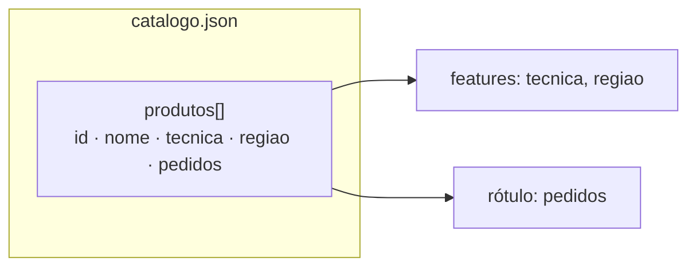
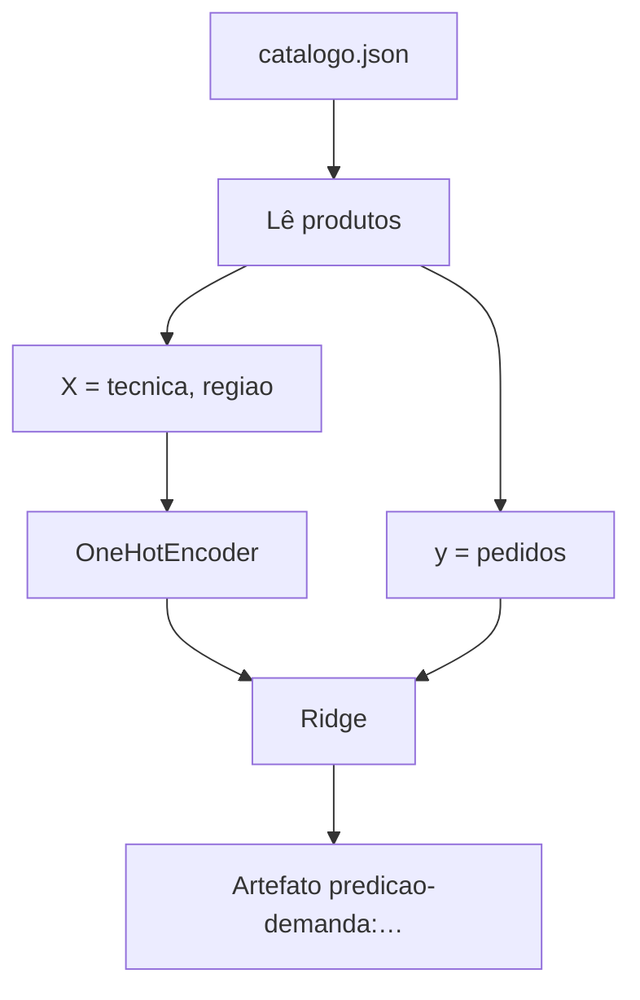

# Dados (`dados/`)

Catálogo de exemplo usado pelo treino e pelo serviço. Um único arquivo:
[`catalogo.json`](catalogo.json).

## Por que este conjunto existe

A loja da aula precisa de produtos com **técnica**, **região** e um sinal de
**demanda** (`pedidos`). O JSON é pequeno de propósito: dá para conferir one-hot,
pesos da Ridge e MAE à mão, e ainda assim exercitar a API de ponta a ponta.

## Forma do arquivo

```json
{
  "produtos": [
    { "id", "nome", "tecnica", "regiao", "pedidos" }
  ]
}
```



| Campo | Significado |
| --- | --- |
| `id` | Chave estável (`p01` … `p12`); a API recebe em `produto_id` |
| `nome` | Rótulo legível na resposta JSON |
| `tecnica` | Família artesanal: `ceramica`, `renda`, `xilogravura`, `cestaria` |
| `regiao` | Polo (Tracunhaém, Alto do Moura, Comunidade do Pilar) |
| `pedidos` | Contagem de demanda — o **rótulo** da regressão |

## Conteúdo atual (resumo)

| Técnica | Quantidade | Regiões | Pedidos (min…max) |
| --- | ---: | --- | --- |
| ceramica | 3 | Tracunhaém | 19…42 |
| renda | 3 | Alto do Moura | 11…35 |
| xilogravura | 3 | Comunidade do Pilar | 9…31 |
| cestaria | 3 | Pilar / Alto do Moura | 8…24 |

Há **12 produtos**. O jarro `p01` (42 pedidos) é o exemplo trabalhado em
[`../material/calculos-trabalhados.md`](../material/calculos-trabalhados.md).

## Como o treino usa estes dados



1. Lê `produtos` → lista de observações.
2. Monta `X` com `tecnica` e `regiao`; `y` com `pedidos`.
3. Ajusta `OneHotEncoder` + `Ridge`.
4. Grava pipeline, catálogo e métricas no artefato BentoML.

Mudou o JSON? Rode `just treino` de novo na raiz do repositório.

## Checklist antes de `just treino`

- [ ] Todo `id` de produto é único.
- [ ] `pedidos` é número ≥ 0.
- [ ] `tecnica` e `regiao` são strings não vazias.
- [ ] Encoding UTF-8; JSON válido (`python -m json.tool dados/catalogo.json`).

## Limites do arquivo de exemplo da aula

- Demanda do `catalogo.json` commitado é **sintética**, inventada para a aula.
- Só há atributos de item (técnica, região): o modelo prevê o **grupo**, e
  produtos do mesmo grupo recebem o mesmo \(\hat{y}\).
- Janela temporal, preço e estoque ficam para um próximo enriquecimento do X.
