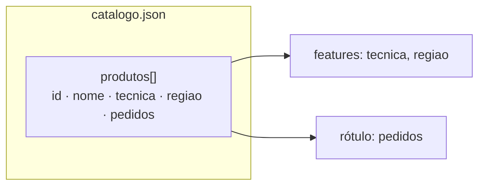
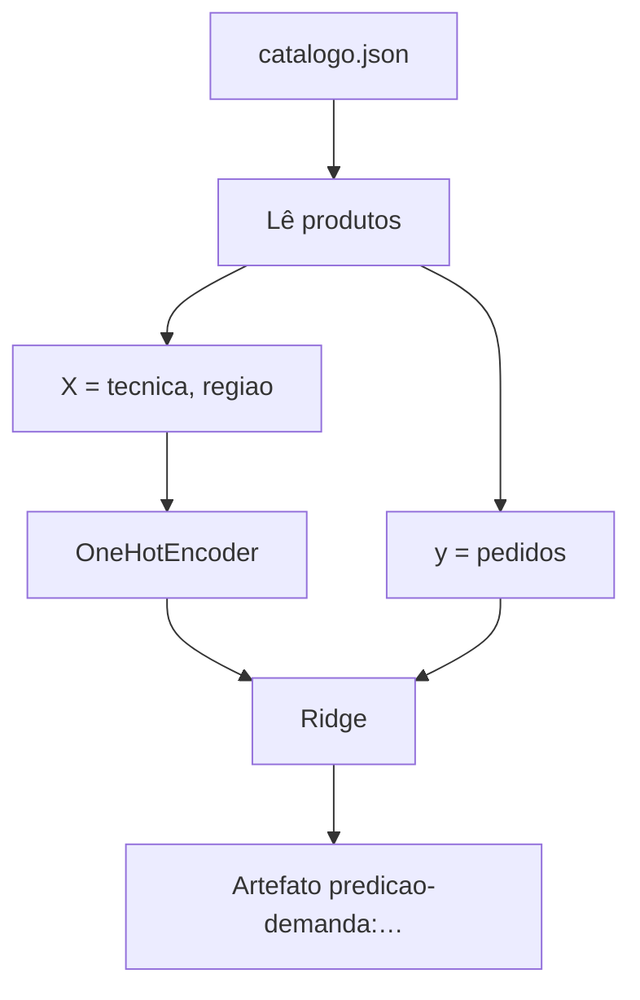

# Dados (`dados/`)

Esta pasta é a **memória da loja** neste exercício: um catálogo pequeno o
bastante para você recalcular one-hot, pesos e erros à mão, e completo o
bastante para treinar uma Ridge e perguntar demanda pela API.

Arquivo único: [`catalogo.json`](catalogo.json).

## Por que este conjunto existe

Imagine o estoquista às vésperas do São João. Ele precisa de três sinais por
peça:

1. **O que é** a peça na linguagem da oficina (`tecnica`)
2. **De onde vem** o saber-fazer (`regiao`)
3. **Quanto pediram** no período de exemplo (`pedidos`)

Com isso dá para montar \(X\) (técnica, região) e \(y\) (pedidos), treinar, e
ainda chutar demanda de uma peça **nova** com a mesma técnica e região. O JSON
cabe numa tela — doze linhas — para o ciclo inteiro caber numa sessão de estudo.

## Forma do arquivo

```json
{
  "produtos": [
    { "id", "nome", "tecnica", "regiao", "pedidos" }
  ]
}
```



| Campo | Significado | Entra no modelo? |
| --- | --- | --- |
| `id` | Chave estável (`p01` … `p12`); a API recebe em `produto_id` | Localiza a linha; fica fora do \(X\) |
| `nome` | Rótulo legível na resposta JSON | Fica fora do \(X\) (evita memorizar a peça) |
| `tecnica` | Família artesanal: `ceramica`, `renda`, `xilogravura`, `cestaria` | Feature (one-hot) |
| `regiao` | Polo (Tracunhaém, Alto do Moura, Comunidade do Pilar) | Feature (one-hot) |
| `pedidos` | Contagem de demanda no período de exemplo | Rótulo \(y\) |

## Conteúdo atual (resumo)

| Técnica | Quantidade | Regiões | Pedidos (min…max) |
| --- | ---: | --- | --- |
| ceramica | 3 | Tracunhaém | 19…42 |
| renda | 3 | Alto do Moura | 11…35 |
| xilogravura | 3 | Comunidade do Pilar | 9…31 |
| cestaria | 3 | Pilar / Alto do Moura | 8…24 |

Há **12 produtos**. O jarro `p01` (42 pedidos) é o fio das contas em
[`../material/calculos-trabalhados.md`](../material/calculos-trabalhados.md).

## Motivação técnica da forma escolhida

- **Um arquivo JSON** — fácil de abrir, versionar e validar
  (`python -m json.tool dados/catalogo.json`).
- **Categorias em texto** — o `OneHotEncoder` do treino transforma; você vê o
  significado sem tabela auxiliar de códigos.
- **`pedidos` já agregado** — o rótulo chega pronto; o foco do material é
  regressão e serviço, não ETL de tickets.
- **Catálogo curto** — MAE, RMSE e R² cabem no caderno; o efeito da Ridge
  (previsão do grupo um pouco abaixo da média do grupo) fica visível.

## Como o treino lê estes dados



1. Lê `produtos` → lista de observações.
2. Monta `X` com `tecnica` e `regiao`; `y` com `pedidos`.
3. Ajusta `OneHotEncoder` + `Ridge`.
4. Grava pipeline, catálogo e métricas no artefato BentoML.

Mudou o JSON? Na raiz do repositório: `just treino` de novo (e reinicie o
`just serve` se ele já estiver no ar).

## Checklist antes de `just treino`

- [ ] Todo `id` de produto é único.
- [ ] `pedidos` é número ≥ 0.
- [ ] `tecnica` e `regiao` são strings não vazias.
- [ ] Encoding UTF-8; JSON válido (`python -m json.tool dados/catalogo.json`).

## Limites deste arquivo de exemplo

- Os `pedidos` são **sintéticos** — inventados para o exercício caber no papel.
- Só há atributos de item (técnica, região): o modelo prevê o **grupo**; peças
  do mesmo grupo compartilham o mesmo \(\hat{y}\).
- Janela temporal, preço e estoque ficam como enriquecimento futuro do \(X\).
