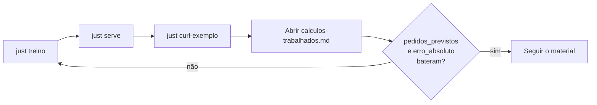

# Material (`material/`)

Esta pasta é o **caderno** do exercício: as contas que a API devolve em JSON,
escritas em português e alinhadas ao `just curl-exemplo`.

Quando o serviço responde `pedidos_previstos ≈ 28,56` para o jarro, este
markdown mostra *de onde* veio o número — one-hot, intercepto, pesos da Ridge,
erro absoluto e métricas do catálogo.

| Arquivo | Conteúdo |
| --- | --- |
| [`calculos-trabalhados.md`](calculos-trabalhados.md) | Fio do jarro (`p01`): features → one-hot → pesos → \(\hat{y}\) → MAE/RMSE/R² → conferência com a API |

## Por que este caderno existe

Treinar e servir é rápido (`just treino` · `just serve`). Entender o chute da
loja pede o caminho inverso: partir do JSON da resposta e reconstruir a conta.
Assim a Ridge deixa de ser uma caixa preta e vira soma de pesos que você pode
repetir no papel.

## Como conferir com a API

1. Na raiz: `just treino` e `just serve`.
2. Noutro terminal: `just curl-exemplo`.
3. Compare `pedidos_previstos` e `erro_absoluto` com a tabela final de
   [`calculos-trabalhados.md`](calculos-trabalhados.md).
4. Se divergir, o catálogo ou o artefato mudaram — rode `just treino` de novo.

Valores de referência do jarro (`p01`): \(\hat{y} \approx 28{,}56\),
erro absoluto \(\approx 13{,}44\), `mae_treino ≈ 7,425`.
