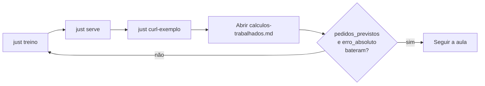

# Material (`material/`)

Textos de apoio à aula que acompanham o código — para ler e projetar junto com
o `curl` e o Swagger.

| Arquivo | Conteúdo |
| --- | --- |
| [`calculos-trabalhados.md`](calculos-trabalhados.md) | Contas do jarro (`p01`): one-hot, pesos da Ridge, \(\hat{y}\), MAE/RMSE/R² |

## Como usar na sala

1. Suba a API (`just treino` · `just serve` na raiz).
2. Rode `just curl-exemplo`.
3. Compare `pedidos_previstos` e `erro_absoluto` com a tabela final do markdown.
4. Se divergir, o catálogo ou o artefato ficaram desatualizados — `just treino` de novo.
